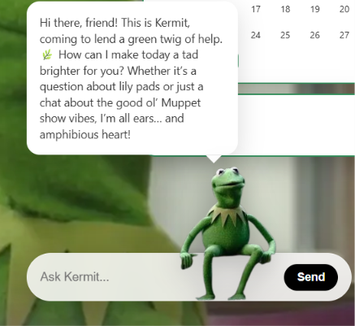
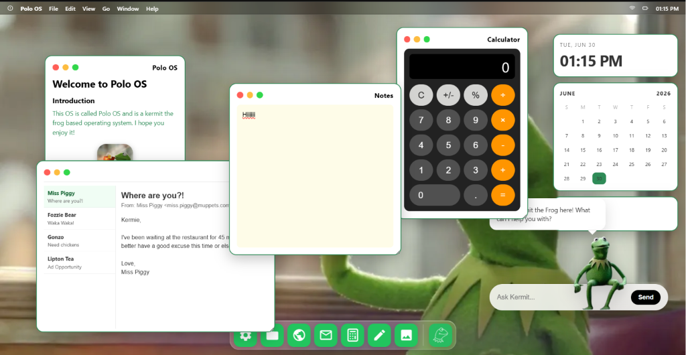
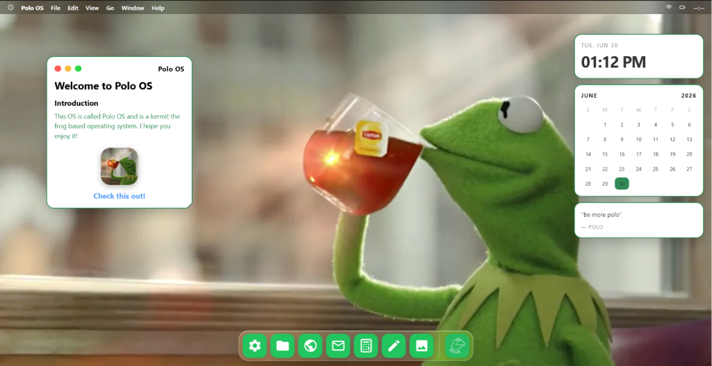

# PoloOS

A simple operating system for Kermit fans. It includes apps and secret easter eggs and references only true kermit fans can understand. It also has a kermit assistant that is powered by AI to give kermit themed answers to your wildest questions. 
Take a look at some screenshots provided below and I can explain them to you.

ENJOY!

## Screenshots

### Kermit Assistant

### Desktop with Multiple Windows

### Welcome Screen & Tea Wallpaper

### Kermit Wallpapers

